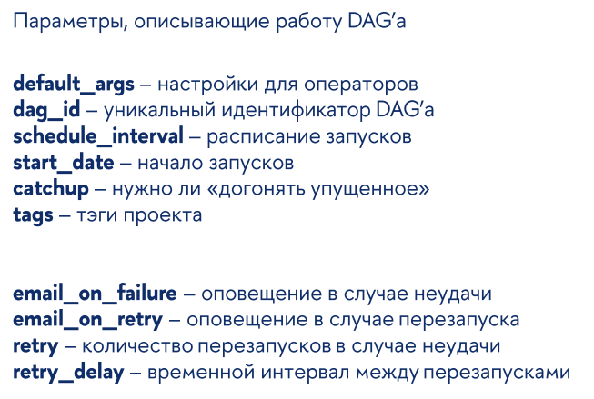
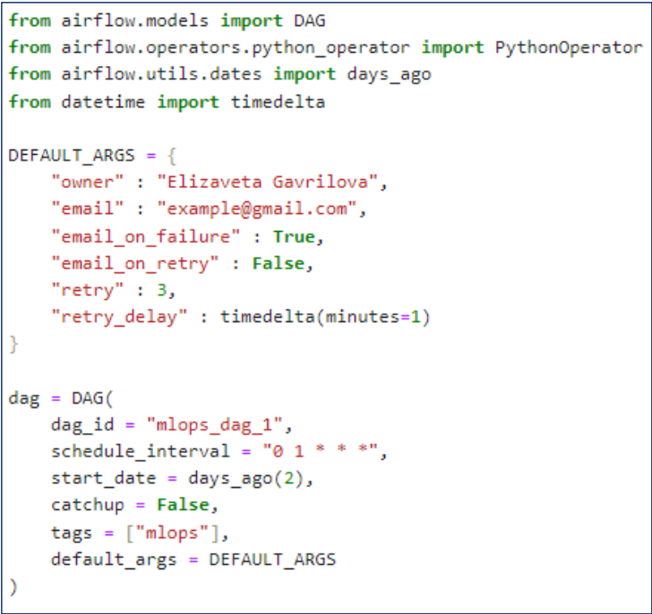
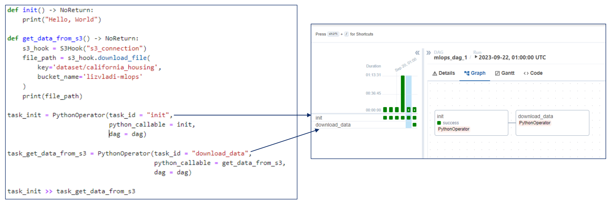

# MLOps
## Airflow
### Three main components:  
- UI (Web Server)
- Scheduler (like project manager). Work with Executor. Run DAGs
- Workers (processes)  

### Executor types  
  
Additionaly run `SQLite`.  
Noone use `SQLite` in prod because it one-thread and not robust    

In prod we can use `PostgreSQL`, `MySQL`, `MSSQL`

By default `Airflow` creates `SQLite` DB  
`airflow standalone` - config and create DB for the first time

### DAGs  
Directed acyclid graph  
Take args to initialize  

Simple code:  

DAGs starts in `start_date` + `interval`  
`start_date` must be in the past  

### PythonOperator  

### Hoks  
Need to create connection  
Use it for passwords and confidectial info that do not for commom user  

## MLFlow  
Automize  
- Tracking  
- Projects (packing experimantations)  
- Models  (Packing models)
- Registry (repository)  

## S3  
S2 - Simple Storage Service  
S3 for AWS initially  
We can access for DB using URL and locate Models in it  
Connection realize using API or Web-interface  

